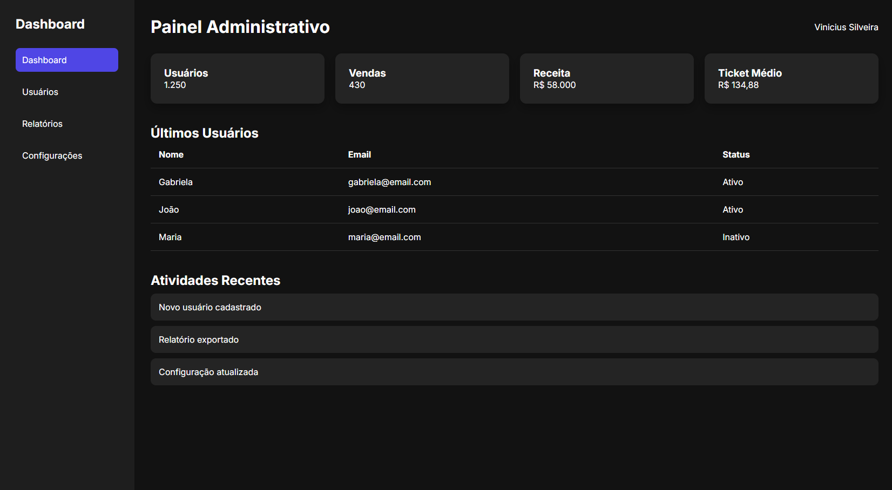

# Dashboard Responsivo

Projeto desenvolvido com HTML5 e CSS3 como parte da minha trilha de estudos em Desenvolvimento Frontend.

O objetivo deste projeto foi criar um dashboard administrativo moderno e responsivo, simulando a interface de sistemas reais utilizados por empresas, enquanto pratico conceitos avançados de estruturação de layouts e organização visual.



## Sobre o Projeto

Este projeto representa uma evolução natural após a construção de páginas estáticas e landing pages. O foco aqui foi aprender como aplicações administrativas são organizadas e como estruturar interfaces que exibem informações de maneira clara e intuitiva.

O dashboard foi construído aplicando boas práticas de HTML semântico, Flexbox, CSS Grid e responsividade, buscando uma arquitetura simples, organizada e preparada para futuras integrações com JavaScript e APIs.

## Funcionalidades

- Sidebar de navegação
- Header principal
- Cards de métricas (KPIs)
- Tabela de dados
- Área de atividades recentes
- Layout responsivo para desktop e dispositivos móveis
- Efeitos de hover e microinterações
- Estrutura preparada para expansão futura

## Tecnologias Utilizadas

- HTML5
- CSS3
- Flexbox
- CSS Grid
- CSS Variables
- Google Fonts (Inter)
- Media Queries
- Git
- GitHub

## Estrutura do Projeto

```text
dashboard-admin/

├── index.html
│
├── css/
│   └── style.css
│
├── images/
│   └── preview.png
│
└── README.md
```

## Conceitos Praticados

Durante o desenvolvimento deste projeto foram trabalhados os seguintes conceitos:

### HTML

- Estrutura semântica
- `<header>`
- `<aside>`
- `<nav>`
- `<main>`
- `<section>`
- Tabelas HTML

### CSS

- Reset CSS
- Variáveis CSS
- Flexbox avançado
- CSS Grid
- Hover Effects
- Transitions
- Responsividade
- Media Queries

### UI/UX

- Hierarquia visual
- Distribuição de informações
- Componentização de interface
- Contraste e legibilidade
- Organização de dashboards
- Experiência do usuário em aplicações administrativas

## Aprendizados

Este projeto foi importante para compreender como sistemas corporativos são estruturados visualmente e como organizar layouts mais complexos.

Principais aprendizados:

- Planejamento de interfaces administrativas
- Estruturação de dashboards modernos
- Utilização combinada de Flexbox e CSS Grid
- Construção de componentes reutilizáveis
- Desenvolvimento mobile-friendly
- Organização e escalabilidade de projetos Frontend

## Melhorias Futuras

Algumas evoluções planejadas para as próximas versões:

- Adicionar ícones ao menu lateral
- Implementar gráficos e estatísticas
- Criar tema claro e escuro
- Adicionar animações de entrada
- Consumir dados de uma API
- Tornar os indicadores dinâmicos com JavaScript
- Implementar menu lateral retrátil (collapsible sidebar)

## Como Executar o Projeto

Clone este repositório:

```bash
git clone https://github.com/seu-usuario/dashboard-admin.git
```

Acesse a pasta do projeto:

```bash
cd dashboard-admin
```

Abra o arquivo `index.html` em seu navegador.

## Projeto Online

Acesse a versão publicada:

```text
https://seu-link-aqui.com
```

## Próximos Passos

Este projeto faz parte da minha trilha prática de estudos em Frontend. Os próximos desafios incluem:

- Sistema de Notas com JavaScript
- Busca de CEP consumindo API
- Aplicação de Clima utilizando API pública
- Portfólio com animações avançadas
- Projetos utilizando React

## Autor

**Vinicius D. Silveira**

Estudante de Análise e Desenvolvimento de Sistemas, focado em Desenvolvimento Frontend e na construção de projetos práticos para evolução técnica e fortalecimento do portfólio.

---

Desenvolvido como parte da minha jornada de aprendizado em Frontend e Desenvolvimento Web.
